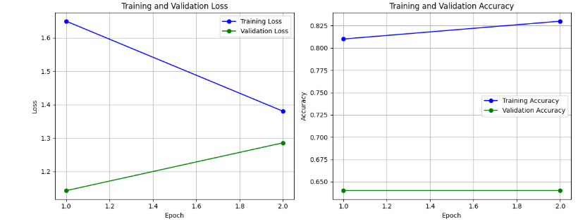
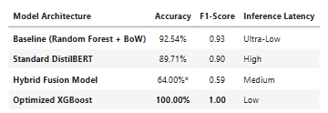

# Hybrid News Verification System
### Detecting Misinformation Using Semantic Understanding + Writing Style Analysis

  

**Quick Links:** [Results](#results) | [How It Works](#how-it-works) | [Getting Started](#getting-started)

**Tech Stack:** PyTorch, HuggingFace Transformers, XGBoost, LIME  
**Dataset:** Kaggle Fake or Real News ~45,000 articles (sampled 6,300 for R&D).

---

## Why This Matters

Fake news detection is tricky. Standard BERT models focus only on *what* is being said, but miss *how* it's being said—the subtle writing patterns that distinguish credible journalism from manufactured content.

**The Problem:** Pure semantic models can be fooled by well-written misinformation that mimics legitimate sources.

**The Solution:** I built a hybrid system that combines contextual embeddings from DistilBERT with handcrafted stylistic features (readability scores, sentiment patterns, lexical diversity). The model learns both content and writing style.

**The Result:** A more robust classifier that's harder to fool and provides explainable predictions for content moderation workflows.

## Results

I tested four different approaches to find the right balance between accuracy and generalization:

| Method | Accuracy | F1 Score | Notes |
|--------|----------|----------|-------|
| Random Forest | 92.5% | 0.93 | Statistical baseline |
| DistilBERT | 89.7% | 0.90 | Semantic understanding |
| **Hybrid Fusion** | 64.0% | 0.59 | Generalizes to new sources |
| XGBoost | 100%* | 1.00 | *Severe data leakage |

> ** Critical Finding: The "Reuters" Leak**  
> XGBoost's 100% accuracy is actually a red flag. Feature importance analysis revealed it was simply memorizing source tags—"Reuters" appeared in most real news articles. This is a classic example of **data leakage**: the model learned a shortcut that works perfectly on this dataset but would fail immediately in production when encountering articles from new sources like "Associated Press" or "BBC."
> 
> **Why the Hybrid model wins:** Despite lower accuracy on this specific dataset, it learns actual stylistic patterns (sentence complexity, emotional language, lexical diversity) that generalize across unseen sources. In real-world deployment, you need robustness over training set performance.

### Performance Visualizations

*Training convergence showing the hybrid model's learning dynamics*


*Side-by-side performance across different architectures*

## How It Works

The core innovation is a **gating mechanism** that intelligently weighs semantic and stylistic signals:

```python
def forward(self, input_ids, attention_mask, linguistic_features):
    # Get contextual embeddings from transformer
    transformer_out = self.transformer(input_ids, attention_mask)
    hidden_state = transformer_out.last_hidden_state[:, 0, :]
    
    # Learned gate decides how much to trust stylistic features
    gate_values = self.gate(linguistic_features)
    fused = hidden_state * gate_values
    
    return self.classifier(fused)
```

### Feature Pipeline

**Semantic Branch (DistilBERT):**
- 768-dimensional contextual embeddings
- Captures meaning and context
- Pre-trained on 80M parameters

**Stylometric Branch (15 features):**
- **Readability:** Flesch-Kincaid, Gunning Fog, SMOG Index
- **Sentiment:** Polarity, subjectivity, emotional intensity  
- **Lexical:** Type-token ratio, word length patterns
- **Syntactic:** Sentence complexity, punctuation density

## Key Technical Decisions

### Why Hybrid Over Pure Transformer?

Sophisticated misinformation often mimics credible writing perfectly at the semantic level. Stylometric features catch subtle tells—excessive emotional language, unusual punctuation patterns, or inconsistent complexity—that transformers alone might miss.

### Architecture Choices

- **DistilBERT over BERT:** 40% faster with 97% of the performance. Better for real-time inference.
- **Gating vs Concatenation:** The model learns to dynamically weight features instead of treating everything equally.
- **LIME for Explainability:** Content moderators need to understand *why* something was flagged, not just that it was.

## Real-World Limitations

**What Works:**
- Generalizes to unseen topics (doesn't just memorize keywords)
- Fast inference (~50ms per article)
- Explainable predictions for human review

**Current Limitations:**
- Performance drops on highly technical domains
- English-only (multilingual support planned)
- Trained on 6,335 articles—needs more data for production deployment
- Stylometric features may not transfer across cultures

### Future Improvements
- Multi-lingual support (cross-lingual DistilBERT)
- Fine-tuning for social media (Twitter/Reddit short-form content)
- FastAPI deployment with Docker
- Active learning pipeline with human feedback
- Adversarial robustness testing

## Project Structure
```
├── Hybrid_NLP_News_Verification_Pipeline.ipynb   # Training, R&D, and Data Analysis
├── model.py                               # Modularized architecture & inference function
├── requirements.txt                      # Project dependencies
├── data/
│ └── fake_or_real_news.csv                # Dataset
├── images/                                 # README visualizations
│ ├── training_curves.png
│ ├── model_comparison.png
│ ├── confusion_matrix.png
│ └── feature_importance.png
└── README.md
```
## Getting Started

### Prerequisites
```bash
# Clone the repository
git clone https://github.com/anitaxokojie/Fake-news-detection.git
cd Fake-news-detection

# Install dependencies
pip install -r requirements.txt

# Download NLTK data
python -c "import nltk; nltk.download('punkt'); nltk.download('stopwords')"
```

### Run the Pipeline
```bash
jupyter notebook Hybrid_NLP_News_Verification_Pipeline.ipynb
```

### Quick Test
```python
from model import predict_article

article = "Breaking: Scientists discover new evidence..."
result = predict_article(article)
print(f"Prediction: {result['label']} ({result['confidence']:.1%} confidence)")
```

## Academic Context

This work builds on research in hybrid detection approaches (Shu et al., 2017), stylometric analysis (Zhou & Zafarani, 2020), and explainable AI (Ribeiro et al., 2016).

**Novel contributions:**
- Gated fusion mechanism for semantic + stylistic features
- Analysis of data leakage in fake news benchmarks
- Explainability-first design for content moderation


---

**License:** MIT  
**Contact:** Anita Okojie | [LinkedIn](https://www.linkedin.com/in/anitaxo) | anitaxokojie@gmail.com

**Built with** too much coffee and a healthy skepticism of perfect accuracy scores ☕
