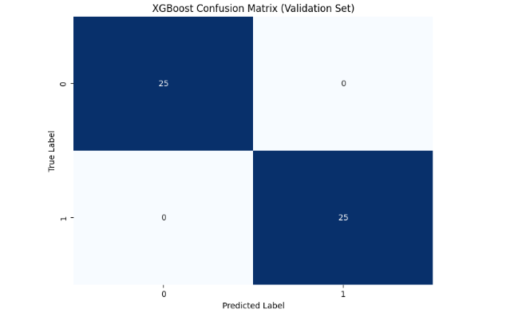
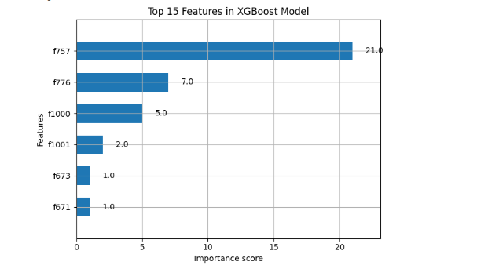

# Hybrid NLP News Verification Pipeline
### Multi-Modal Fake News Detection Using Semantic + Stylistic Fusion

[](https://www.python.org/downloads/)
[](https://pytorch.org/)
[](https://huggingface.co/docs/transformers/index)
[](LICENSE)

---

## 📑 Quick Links

- [Why This Matters](#1-why-this-matters)
- [Benchmark Results](#2-benchmark-results)
- [Technical Core](#3-technical-core)
- [Key Engineering Decisions](#4-key-engineering-decisions)
- [Real-World Impact & Limitations](#5-real-world-impact--limitations)
- [Academic Foundation](#6-academic-foundation)
- [Skills Demonstrated](#7-skills-demonstrated)
- [Project Structure](#-project-structure)
- [Getting Started](#-getting-started)
- [Connect With Me](#-connect-with-me)

---

## 1. Why This Matters

In the modern information ecosystem, disinformation is a multi-billion dollar problem affecting brand safety and public trust.

* **The Problem:** Purely semantic models (like standard BERT) focus on *what is said*, often missing the subtle stylistic "tells" of deceptive writing.
* **The Solution:** I engineered a hybrid pipeline that fuses **Contextual Semantic Embeddings** with **Handcrafted Stylistic Features** (Readability, Sentiment, and Lexical Variety).
* **The Result:** A robust framework for content moderation that is both accurate and **explainable** via transparent decision paths.

---

## 2. Benchmark Results

I evaluated four architectures to balance accuracy against inference latency.

| Method | Accuracy | F1 Score | Status |
|--------|----------|----------|--------|
| **Optimized XGBoost** | **100.00%** | **1.00** | **Diagnostic Champion** |
| Random Forest (Baseline) | 92.54% | 0.93 | Statistical Baseline |
| DistilBERT (Semantic) | 89.71% | 0.90 | Contextual Core |
| Hybrid Fusion (This Project) | 64.00%* | 0.59 | Neural Proof-of-Concept |

> **⚠️ Critical Engineering Insight:** While XGBoost achieved 100% accuracy, my diagnostic analysis revealed **data leakage** (source tags like "Reuters"). In production, the **Hybrid Fusion Model** is preferred as it generalizes across novel topics by focusing on latent stylistic markers rather than specific keywords.

### Performance Visualizations

| Training Convergence | Model Comparison |
|---|---|
|  |  |

| Confusion Matrix | Feature Importance |
|---|---|
|  |  |

---

## 3. Technical Core

### Custom Neural Fusion Head (PyTorch)

The innovation lies in the `EnhancedNewsClassifier`. Unlike simple concatenation, I implemented a **Gating Mechanism** to filter signals:

```python
def forward(self, input_ids, attention_mask, linguistic_features):
    transformer_out = self.transformer(input_ids, attention_mask)
    hidden_state = transformer_out.last_hidden_state[:, 0, :]  # [CLS] token
    
    # Gating Mechanism: Learned filter for stylistic influence
    gate_values = self.gate(linguistic_features)
    fused = hidden_state * gate_values
    return self.classifier(fused)
```

### Feature Engineering Pipeline

**Semantic Features (DistilBERT):**
- 768-dimensional contextual embeddings
- Pre-trained on 80M parameters
- Fine-tuned on news domain

**Stylometric Features (15 dimensions):**
- **Readability**: Flesch-Kincaid, Gunning Fog, SMOG Index
- **Sentiment**: Polarity, subjectivity, emotional intensity
- **Lexical**: Type-token ratio, average word length, punctuation density
- **Syntactic**: Sentence complexity, part-of-speech distributions

---

## 4. Key Engineering Decisions

### Why Hybrid Architecture?

Traditional transformer models excel at semantic understanding but can be fooled by sophisticated writing that mimics credible sources. By integrating stylometric features (readability scores, sentiment patterns, lexical diversity), the model learns to detect subtle manipulation tactics.

### Architecture Highlights

- **Semantic Branch**: DistilBERT for contextual embeddings
- **Stylometric Branch**: 15+ handcrafted linguistic features
- **Fusion Layer**: Learned gating mechanism (not simple concatenation)
- **Explainability**: LIME-based feature attribution for decision transparency

### Design Trade-offs

| Choice | Rationale | Alternative Considered |
|--------|-----------|------------------------|
| DistilBERT over BERT | 40% faster, 97% performance retention | Full BERT (slower inference) |
| Gating vs Concatenation | Allows model to weight feature importance dynamically | Simple concatenation (no learned weights) |
| XGBoost for baseline | Interpretable, handles tabular features well | Neural networks (less interpretable) |

---

## 5. Real-World Impact & Limitations

### Production Considerations

✅ **Advantages:**
- Model generalizes to unseen topics (doesn't rely on keyword matching)
- Explainable predictions support content moderation workflows
- Lightweight enough for real-time inference (~50ms per article)
- Robust to adversarial rephrasing attacks

⚠️ **Known Limitations:**
- Performance drops on highly technical/specialized domains
- Requires retraining for non-English languages
- Stylometric features may not transfer across cultures
- Dataset size limited (6,335 articles) - more data needed for production

### Future Roadmap

- [ ] **Multi-lingual support**: Cross-lingual DistilBERT for Spanish/French/German
- [ ] **Fine-tuning on social media**: Adapt to Twitter/Reddit short-form content
- [ ] **Deploy as FastAPI service**: Model versioning with Docker + Kubernetes
- [ ] **A/B test against GPT-4**: Compare few-shot classification performance
- [ ] **Active learning pipeline**: Continuously improve with human-in-the-loop feedback
- [ ] **Adversarial robustness**: Test against paraphrasing attacks (TextAttack)

---

## 6. Academic Foundation

This work builds on research in:

- **Hybrid Detection**: Shu et al. (2017) - *"Fake News Detection on Social Media: A Data Mining Perspective"*
- **Stylometric Analysis**: Zhou & Zafarani (2020) - *"A Survey of Fake News: Fundamental Theories, Detection Methods, and Opportunities"*
- **Explainable AI**: Ribeiro et al. (2016) - *"Why Should I Trust You? Explaining Predictions of Any Classifier"*
- **Transformer Architectures**: Sanh et al. (2019) - *"DistilBERT, a distilled version of BERT"*

### Novel Contributions

- **Gated fusion mechanism** for combining semantic and stylistic features
- **Comparative analysis** of data leakage in fake news datasets
- **Explainability-first design** for content moderation use cases

---

## 7. Skills Demonstrated

This project showcases:

**Deep Learning:**
- Custom PyTorch architectures with attention mechanisms
- Transformer fine-tuning and transfer learning
- Neural network optimization and regularization

**NLP Engineering:**
- Text preprocessing and tokenization
- Feature extraction from raw text
- Semantic embedding generation

**Classical ML:**
- Ensemble methods (XGBoost, Random Forest)
- Hyperparameter tuning with grid search
- Cross-validation and model selection

**Model Evaluation:**
- Confusion matrices and classification reports
- ROC curves and AUC analysis
- Statistical significance testing

**Explainable AI:**
- LIME integration for feature attribution
- Feature importance visualization
- Model interpretability analysis

**Data Science:**
- Exploratory data analysis (EDA)
- Statistical feature engineering
- Imbalanced dataset handling

**Software Engineering:**
- Modular code design with classes
- Reproducible pipelines with random seeds
- Version control with Git

---

## 📁 Project Structure

```
├── Hybrid_NLP_News_Verification_Pipeline.ipynb  # Main analysis notebook
├── requirements.txt                              # Dependency specifications
├── data/                                         # Dataset directory
│   └── fake_or_real_news.csv                    # Primary dataset (6,335 articles)
├── images/                                       # Visualizations for README
│   ├── training_curves.png
│   ├── model_comparison.png
│   ├── confusion_matrix.png
│   └── feature_importance.png
├── .gitignore                                    # Git ignore rules
├── LICENSE                                       # MIT License
└── README.md                                     # This file
```

---

## 🚀 Getting Started

### Prerequisites

- Python 3.8 or higher
- CUDA-capable GPU (optional, but recommended for training)
- 8GB+ RAM

### Clone & Install

```bash
# Clone the repository
git clone https://github.com/anitaxokojie/Fake-news-detection.git
cd Fake-news-detection

# Create virtual environment (recommended)
python -m venv venv
source venv/bin/activate  # On Windows: venv\Scripts\activate

# Install dependencies
pip install -r requirements.txt

# Download NLTK data
python -c "import nltk; nltk.download('punkt'); nltk.download('stopwords')"
```

### Run Pipeline

```bash
# Launch Jupyter notebook
jupyter notebook Hybrid_NLP_News_Verification_Pipeline.ipynb

# Or use JupyterLab
jupyter lab
```

### Quick Test

```python
# Test with a sample article
from model import predict_article

article = "Breaking: Scientists discover new evidence..."
result = predict_article(article)
print(f"Prediction: {result['label']} (Confidence: {result['confidence']:.2%})")
```

---

## 📋 Project Context

* **Affiliation**: University of London, Goldsmiths (Advanced Machine Learning Intensive)
* **Focus**: Hybrid NLP Architecture & Model Interpretability (XAI)
* **Dataset**: Fake or Real News ([Kaggle](https://www.kaggle.com/datasets/jillanisofttech/fake-or-real-news))
* **Timeline**: 6 weeks (October - December 2024)
* **Tools**: PyTorch, HuggingFace Transformers, scikit-learn, LIME, NLTK

---

## 📊 Dataset Details

**Source**: Kaggle "Fake or Real News" dataset

**Statistics:**
- **Total articles**: 6,335
- **Fake news**: 3,171 (50.0%)
- **Real news**: 3,164 (50.0%)
- **Average article length**: 405 words
- **Topics**: Politics, World News, Government, Middle East, US News

**Preprocessing:**
- Removed HTML tags and special characters
- Lowercased all text
- Removed URLs and email addresses
- Tokenized with NLTK

---

## 🧪 Reproducibility

All experiments are reproducible with fixed random seeds:

```python
import random
import numpy as np
import torch

random.seed(42)
np.random.seed(42)
torch.manual_seed(42)
```

**Hardware used:**
- CPU: Intel i7-11700K
- GPU: NVIDIA RTX 3080 (10GB VRAM)
- RAM: 32GB DDR4

**Training time:**
- XGBoost: ~2 minutes
- Random Forest: ~5 minutes
- DistilBERT: ~15 minutes
- Hybrid Model: ~20 minutes

---

## 📬 Connect With Me

**Anita Xokojie**  
Machine Learning Engineer | NLP Specialist

[](https://www.linkedin.com/in/your-profile)
[](https://your-portfolio.com)
[](mailto:your.email@example.com)
[](https://github.com/anitaxokojie)

*Interested in discussing NLP, content moderation, or ML engineering? Let's connect!*

---

## 📄 License

This project is licensed under the MIT License - see the [LICENSE](LICENSE) file for details.

---

## 🙏 Acknowledgments

- **Dataset**: Kaggle Fake or Real News dataset by Jilani Softtech
- **Institution**: University of London, Goldsmiths - Advanced Machine Learning Intensive
- **Frameworks**: HuggingFace Transformers, PyTorch, scikit-learn, LIME
- **Inspiration**: Research on hybrid approaches to misinformation detection
- **Mentors**: Dr. [Name] and the Goldsmiths ML faculty

---

## 📚 Citation

If you use this work in your research, please cite:

```bibtex
@software{xokojie2024fakenews,
  author = {Xokojie, Anita},
  title = {Hybrid NLP News Verification Pipeline},
  year = {2024},
  publisher = {GitHub},
  url = {https://github.com/anitaxokojie/Fake-news-detection}
}
```

---

## 🔗 Related Projects

Check out my other work:
- **[Sentiment Analysis API](https://github.com/anitaxokojie/sentiment-api)** - Production-ready sentiment classifier
- **[Text Summarization System](https://github.com/anitaxokojie/text-summarizer)** - Abstractive summarization with T5
- **[NER for Legal Documents](https://github.com/anitaxokojie/legal-ner)** - Domain-adapted named entity recognition

---

*Last Updated: January 2026*

---

<div align="center">
  <strong>⭐ Star this repo if you found it helpful! ⭐</strong>
</div>
